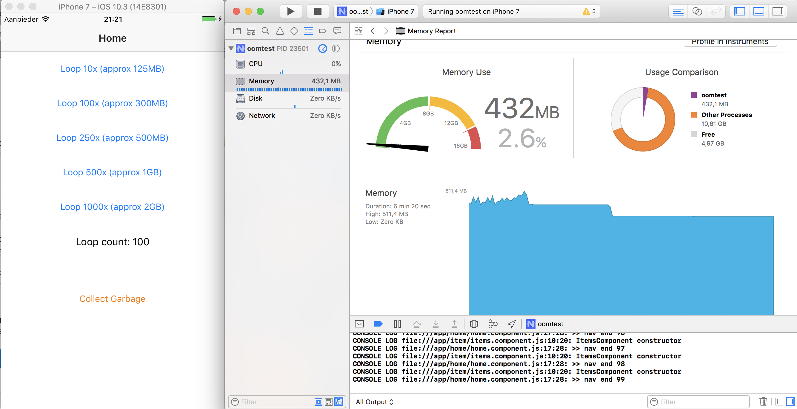
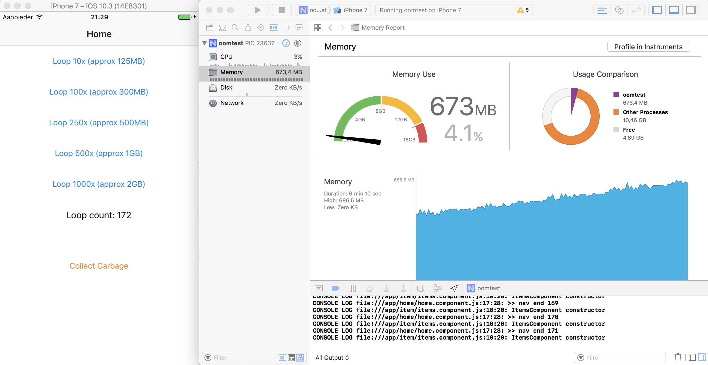
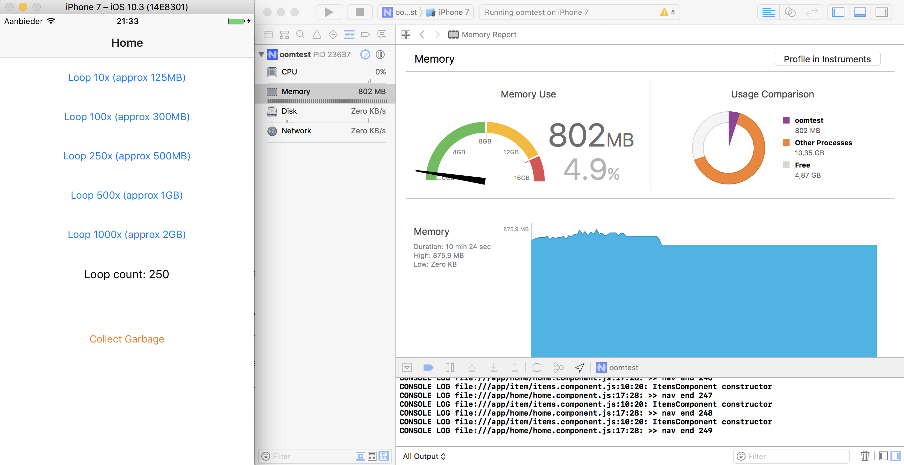
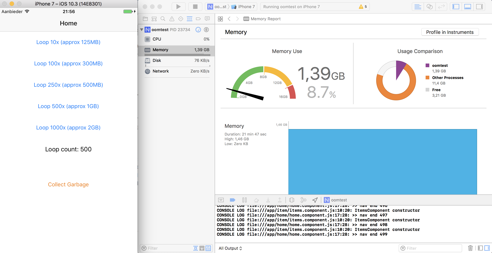

Fully automated {N} _Out Of Memory_ Crash App
=============================================

_NativeScript app, with Angular in "production mode"_

**Crashes on `tns-ios` 3.0.0 and up, not on `tns-ios` 2.5.1 and lower.**


**UPDATE Aug 25, 2017:** 🎉🎉🎉 The awesome NativeScript engineers have fixed the issue! See [this comment](https://github.com/NativeScript/NativeScript/issues/4490#issuecomment-324918952) for details.

```bash
git clone https://github.com/EddyVerbruggen/nativescript-ios-out-of-memory
cd nativescript-ios-out-of-memory
tns build ios [--release]
```

Open the `.xcodeproj` file in `platforms/ios` in Xcode and run it on a device
(you can also use a Simulator but its memory heap is much larger).

As shown below, select the memory graph and select any of the "Loop ..x" buttons to
navigate to a page with a ListView, and back().
 
Navigating back should release all items, but clearly it doesn't. **Approximately 1 MB of data is retained in memory for every loop.**

Even invoking `GC()` manually doesn't help much (you can press that button at the bottom after all loops have ended).

Eventually, this leads to an Out of Memory exception and the app crashes. That's easy to reproduce with this app by picking 500 loops and running on a device with 1 GB RAM (iPhone 5S or lower, iPad Air or lower) as they only have about 500 MB of heap available.

Here's a few screenshots of heap consumption on a simulator, after running the nr of loops as shown on the phone, and after manually invoking `GC()`:

#### 100 loops (should work on most phones)
You can see the huge 432MB block of retained memory sitting there.



#### 172 loops (enough to crash an iPhone 5S / iPad Air)
This was shot while running the app, so the ever growing heap is shown nicely.



#### 250 loops (enough to crash an iPhone 6S / iPad Air 2)
Not 2.5x the 100 loops heap, as the app's baseline (before looping) is about 120MB.



#### 500 loops (probably enough to even crash an iPad Pro)
Quite the lineair growth, as compared to the others. A clear indication of a memory leak IMO.


